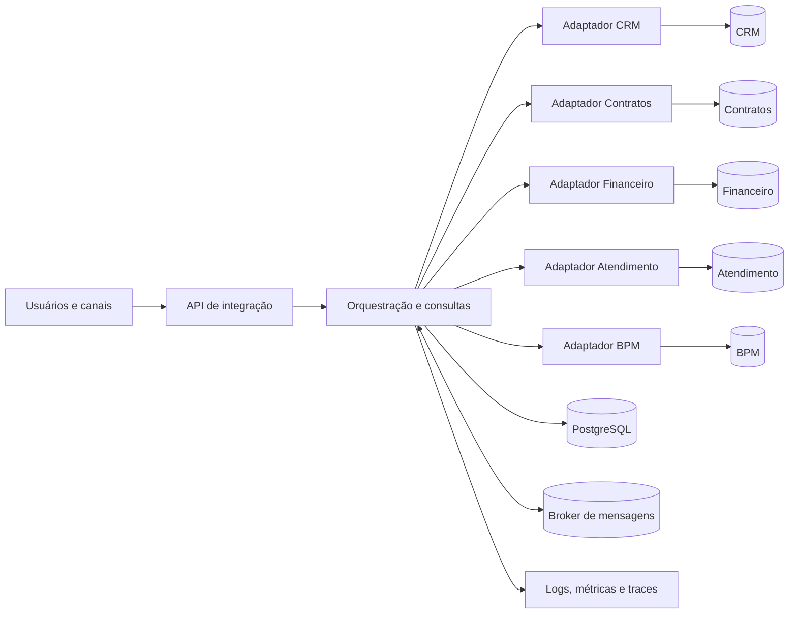

# Plano de implementação - Cenário 4: Empresa de serviços

## 1. Objetivo

Construir um protótipo arquitetural que demonstre a integração entre CRM, contratos, financeiro, atendimento e gestão de processos, reduzindo recadastro, divergência de informações e acoplamento ponto a ponto.

O plano atende ao enunciado do projeto, especialmente aos itens de análise AS-IS, requisitos, arquitetura TO-BE, padrões arquiteturais, APIs e integração, sistemas corporativos, interoperabilidade, atributos de qualidade, evolução, viabilidade e demonstração prática de pelo menos três fluxos integrados.

## 2. Escopo da primeira entrega

### Incluído

- Documento AS-IS com sistemas, atores, dados, processos, dependências e problemas.
- Arquitetura TO-BE com fronteiras de domínio e mecanismos de comunicação.
- Protótipo executável com APIs documentadas em OpenAPI.
- Simuladores ou adaptadores para os cinco sistemas corporativos.
- Três fluxos integrados ponta a ponta.
- Persistência local, mensageria, auditoria e observabilidade mínimas.
- Testes automatizados e roteiro de demonstração.
- Diagramas, exemplos de requisição/resposta e material para o relatório técnico.

### Fora do escopo

- Substituir integralmente os cinco sistemas corporativos.
- Migração completa dos dados históricos.
- Alta disponibilidade real em múltiplas regiões.
- Integrações com bancos, emissão fiscal ou assinatura eletrônica reais.
- Aplicativo final com todos os recursos operacionais de CRM, ERP, ITSM ou BPM.

## 3. Premissas a validar

O PDF informa quais sistemas existem, mas não descreve produtos, tecnologias nem fluxos atuais. Portanto, os itens abaixo são hipóteses de trabalho e devem ser confirmados com o professor ou responsável de negócio antes da implementação:

- Cada sistema possui seu próprio cadastro e identificador de cliente.
- Há recadastro manual e troca de planilhas/arquivos entre áreas.
- O CRM é a fonte oficial de dados cadastrais do cliente.
- O sistema de contratos é a fonte oficial de contratos, vigências e SLA contratado.
- O financeiro é a fonte oficial de cobranças, títulos e pagamentos.
- O atendimento é a fonte oficial de chamados e seu histórico.
- O BPM é a fonte oficial de instâncias, tarefas e estados dos processos.
- Sistemas legados podem não publicar eventos; adaptadores serão usados para traduzir seus formatos.

## 4. Visão AS-IS inicial

### Atores

- Comercial: prospecta, cadastra clientes e acompanha oportunidades no CRM.
- Jurídico/Contratos: elabora, aprova, ativa e encerra contratos.
- Financeiro: gera cobranças, baixa pagamentos e trata inadimplência.
- Atendimento: registra e resolve chamados conforme o SLA.
- Operações/Gestão: acompanha processos, prazos, filas e indicadores.
- Cliente: contrata o serviço, recebe cobrança e solicita atendimento.

### Problemas prováveis

- Cliente duplicado, com chaves e campos diferentes em cada sistema.
- Ativação de contrato sem criação automática da cobrança ou do onboarding.
- Atendimento sem acesso confiável ao plano e ao SLA contratado.
- Mudanças de cadastro propagadas manualmente e em momentos diferentes.
- Integrações ponto a ponto, sem contrato, rastreabilidade ou tratamento uniforme de erros.
- Baixa visibilidade sobre falhas e transações que atravessam vários sistemas.

### Artefato AS-IS a produzir

Um diagrama de contexto deve mostrar os cinco sistemas isolados, os usuários, as trocas manuais e os pontos de duplicidade. Cada afirmação sobre o estado atual deve ser marcada como confirmada ou como premissa.

## 5. Requisitos

### Requisitos funcionais prioritários

| ID | Requisito | Critério de aceite |
|---|---|---|
| RF-01 | Manter uma referência única de cliente entre os sistemas. | Todo registro integrado carrega `customerId` global e os identificadores legados associados. |
| RF-02 | Criar contrato a partir de um cliente existente no CRM. | Um cliente elegível origina um rascunho de contrato sem recadastro manual. |
| RF-03 | Ativar o contrato e iniciar faturamento e onboarding. | A ativação cria uma cobrança e uma instância de processo, sem duplicar efeitos em reprocessamentos. |
| RF-04 | Abrir chamado considerando contrato, serviço e SLA válidos. | O atendimento consulta a elegibilidade e registra o SLA aplicável. |
| RF-05 | Propagar alterações cadastrais relevantes. | Alteração publicada pelo CRM chega aos consumidores e fica auditável. |
| RF-06 | Consultar o estado consolidado de uma operação. | É possível rastrear uma transação pelo `correlationId`. |
| RF-07 | Reprocessar integrações com falha. | Operador identifica a falha, consulta o motivo e reprocessa a mensagem com segurança. |

### Requisitos não funcionais prioritários

- Interoperabilidade: contratos versionados, JSON/UTF-8, datas ISO 8601, valores monetários com moeda explícita e modelo canônico mínimo.
- Confiabilidade: outbox transacional, consumidores idempotentes, retentativas com atraso e fila de mensagens não processadas.
- Segurança: autenticação OIDC/OAuth 2.0, autorização por papéis, TLS, validação de entrada, segredos fora do código e trilha de auditoria.
- Observabilidade: logs estruturados, métricas, traces, `correlationId`, health checks e painel mínimo da demonstração.
- Manutenibilidade: módulos independentes, dependências dirigidas para interfaces, testes de contrato e decisões registradas em ADR.
- Desempenho: resposta p95 inferior a 500 ms nas consultas locais do protótipo, excluindo dependências simuladas deliberadamente lentas.
- Escalabilidade: APIs sem estado e consumidores dimensionáveis independentemente quando forem extraídos.

## 6. Arquitetura TO-BE



### Estilo e implantação do protótipo

- SOA pragmática, com capacidades de negócio expostas por contratos claros.
- Monólito modular na primeira entrega para reduzir custo operacional e facilitar a demonstração.
- Arquitetura hexagonal em cada módulo, separando domínio, aplicação e adaptadores.
- Integração síncrona por REST para comandos/consultas que exigem resposta imediata.
- Integração assíncrona por eventos para propagar mudanças e executar efeitos desacoplados.
- PostgreSQL como persistência do protótipo, com esquema lógico por módulo e sem leitura direta do esquema de outro módulo.
- RabbitMQ como broker local de referência. Uma implementação equivalente pode ser adotada se preservar as garantias definidas neste plano.
- Docker Compose para execução reprodutível no ambiente acadêmico.

### Responsabilidade e fonte oficial de dados

| Sistema/módulo | Responsabilidade | Dados oficiais |
|---|---|---|
| CRM | Relacionamento e cadastro comercial | Cliente, contatos, consentimentos, oportunidade |
| Contratos | Ciclo de vida contratual | Contrato, itens, vigência, plano e SLA |
| Financeiro | Cobrança e recebimento | Fatura/título, vencimento, pagamento, inadimplência |
| Atendimento | Gestão de solicitações | Chamado, prioridade, histórico e resolução |
| BPM | Coordenação de processos | Instância, tarefa, responsável, prazo e estado |
| Integração | Tradução, roteamento e rastreabilidade | Mapeamentos de IDs, outbox, inbox, falhas e correlação |

## 7. Modelo de interoperabilidade

- Identificadores globais: UUID para `customerId`, `contractId`, `invoiceId`, `ticketId` e `processId`.
- Identificadores legados: mantidos em tabela de mapeamento por sistema de origem.
- Envelope de evento: `eventId`, `eventType`, `eventVersion`, `occurredAt`, `correlationId`, `causationId`, `producer` e `payload`.
- Contratos: OpenAPI para REST e AsyncAPI ou JSON Schema para eventos.
- Versionamento: versão maior na URL REST (`/api/v1`) e no tipo/esquema do evento; mudanças compatíveis são aditivas.
- Consistência: forte dentro de uma transação do módulo e eventual entre sistemas.
- Conflitos: a fonte oficial vence; divergências são registradas e enviadas para análise, sem sobrescrever silenciosamente.
- Privacidade: trocar apenas os campos necessários ao fluxo; evitar CPF, dados bancários e conteúdo sensível em logs e eventos.

### Exemplo de problema e solução

Problema: o CRM identifica um cliente pelo e-mail, enquanto contratos usa um código numérico e atendimento cria outro cadastro pelo CPF. Isso gera duplicidade e chamados vinculados ao contrato errado.

Solução: ao integrar o primeiro registro, o serviço de integração gera um `customerId` global e guarda a relação com cada identificador legado. Os contratos REST e eventos carregam o identificador global. Regras de correspondência só sugerem vínculos; casos ambíguos seguem para conciliação manual e ficam auditados.

## 8. Fluxos integrados da demonstração

| Fluxo | Origem -> destino | Comunicação | Informação | Tratamento de erro |
|---|---|---|---|---|
| F1 - Cliente para contrato | CRM -> Integração -> Contratos | REST síncrono | Cliente, contatos, serviço negociado | Validação 4xx; timeout/retry limitado; idempotência; erro rastreado |
| F2 - Ativação e onboarding | Contratos -> Broker -> Financeiro e BPM | Evento assíncrono | Contrato ativo, itens, valor, vigência, cliente | Outbox, retry exponencial, consumidor idempotente e fila de erro |
| F3 - Chamado com SLA | Atendimento -> Integração -> Contratos; Atendimento -> Broker -> BPM | REST + evento | Cliente, contrato, serviço, SLA, chamado | Circuit breaker/timeout; abertura em estado pendente se consulta indisponível; posterior reconciliação |

### F1 - Criar contrato a partir do CRM

1. Comercial seleciona um cliente elegível no CRM.
2. CRM chama `POST /api/v1/contracts/drafts` com `Idempotency-Key`.
3. A integração valida e converte o cadastro para o contrato canônico.
4. Contratos devolve `contractId`, estado `DRAFT` e eventuais pendências.
5. O mapeamento de IDs e a auditoria são persistidos.

Exemplo de entrada:

```json
{
  "customerId": "dff9b632-44ca-4b03-bc08-80b718492832",
  "serviceCode": "SUPPORT-PREMIUM",
  "startsOn": "2026-10-01",
  "billing": { "amount": 2500.00, "currency": "BRL", "cycle": "MONTHLY" }
}
```

### F2 - Ativar contrato, faturar e iniciar onboarding

1. Contratos conclui a aprovação e grava a ativação e o evento na mesma transação.
2. A outbox publica `ContractActivated.v1` no broker.
3. Financeiro cria a primeira cobrança.
4. BPM inicia o processo de onboarding.
5. Cada consumidor registra o `eventId`; reentregas não duplicam cobrança nem processo.

### F3 - Abrir chamado com o SLA correto

1. Atendimento envia `customerId`, `contractId`, categoria e descrição.
2. A integração consulta contrato e SLA por REST.
3. Atendimento cria o chamado com prioridade e prazo calculados.
4. `TicketOpened.v1` inicia no BPM o processo de resolução.
5. Se contratos estiver indisponível, o chamado fica `PENDING_ENTITLEMENT` e é reconciliado quando o serviço retorna.

## 9. Qualidade arquitetural

| Atributo | Necessidade/risco | Estratégia | Resultado esperado |
|---|---|---|---|
| Interoperabilidade | Modelos e IDs incompatíveis | Modelo canônico mínimo, adaptadores, mapeamento de IDs e contratos versionados | Sistemas evoluem sem conhecer formatos internos uns dos outros |
| Confiabilidade | Mensagem perdida ou efeito duplicado | Outbox/inbox, idempotência, retry e fila de erro | Entrega ao menos uma vez sem duplicar efeitos de negócio |
| Segurança | Vazamento ou acesso indevido | OIDC, RBAC, TLS, minimização de dados e auditoria | Acesso rastreável e limitado ao necessário |
| Observabilidade | Falha distribuída difícil de localizar | Correlação, logs, métricas e traces | Fluxo ponta a ponta diagnosticável durante a demonstração |
| Manutenibilidade | Alteração em um sistema quebra os demais | Portas/adaptadores, testes de contrato e módulos sem banco compartilhado | Mudanças ficam localizadas e verificáveis |
| Escalabilidade | Aumento de chamadas e eventos | Componentes sem estado e consumidores concorrentes | Partes críticas podem crescer de forma independente |
| Disponibilidade | Dependência fora do ar bloqueia o processo | Timeout, circuit breaker, degradação controlada e processamento assíncrono | Falha parcial não interrompe todo o sistema |

## 10. Plano de execução

### Etapa 0 - Descoberta e baseline

Entregáveis:

- Glossário de negócio e mapa de atores.
- Inventário dos cinco sistemas e respectivos proprietários.
- Diagrama AS-IS.
- Lista de problemas, premissas e dúvidas.
- Requisitos funcionais e não funcionais priorizados.

Aceite: cada sistema tem responsabilidade, usuários, dados produzidos/consumidos, dependências e limitações documentados.

### Etapa 1 - Contratos e fundação

Entregáveis:

- Estrutura do monólito modular e Docker Compose.
- Modelo canônico mínimo e política de identificadores.
- OpenAPI inicial e esquemas dos eventos.
- Banco, migrações, outbox/inbox e correlação.
- Autenticação simulada ou provedor OIDC local.

Aceite: ambiente sobe por um único procedimento documentado; health checks respondem; contratos são validados automaticamente.

### Etapa 2 - Adaptadores e simuladores

Entregáveis:

- Adaptadores para CRM, contratos, financeiro, atendimento e BPM.
- Simuladores com cenários de sucesso, validação, timeout e indisponibilidade.
- Tabela de mapeamento de identificadores legados.

Aceite: cada adaptador pode ser testado isoladamente e nenhum módulo lê diretamente os dados internos de outro.

### Etapa 3 - Três fluxos ponta a ponta

Entregáveis:

- F1, F2 e F3 implementados.
- Coleção de requisições e exemplos de respostas.
- Eventos observáveis no broker.
- Tratamento de repetição, timeout e falhas permanentes.

Aceite: os três fluxos são executados do início ao fim e uma repetição com a mesma chave/evento não duplica resultados.

### Etapa 4 - Qualidade e operação

Entregáveis:

- Testes unitários, de integração, de contrato e ponta a ponta.
- Logs, métricas, traces e painel mínimo.
- Testes de carga básicos e cenários de falha.
- Checklist de segurança e privacidade.

Aceite: falhas são localizáveis por `correlationId`; filas de erro são inspecionáveis; metas mensuráveis dos requisitos não funcionais são registradas.

### Etapa 5 - Documentação e apresentação

Entregáveis:

- Diagramas AS-IS, TO-BE, componentes, integração e sequência.
- OpenAPI/AsyncAPI e exemplos.
- Matriz de requisitos e evidências.
- Roteiro de demonstração com dados preparados.
- Conteúdo do relatório técnico de 15 a 20 páginas.

Aceite: uma equipe externa consegue subir o protótipo, executar os três fluxos e relacionar cada evidência ao requisito correspondente.

## 11. Ordem sugerida do backlog

### P0 - Obrigatório para a avaliação

- AS-IS, requisitos e TO-BE.
- Modelo canônico e fontes oficiais.
- OpenAPI e contratos de eventos.
- Três fluxos integrados.
- Idempotência, tratamento de erro e correlação.
- Cinco ou mais atributos de qualidade avaliados.
- Diagramas, documentação e roteiro da demonstração.

### P1 - Fortalece a solução

- Autenticação OIDC e RBAC completos.
- Dashboard de observabilidade.
- Conciliação manual de cliente ambíguo.
- Testes de carga e caos controlado.
- Pipeline de integração contínua.

### P2 - Evolução futura

- Extração de módulos de maior carga para serviços independentes.
- Conectores reais de assinatura, cobrança e atendimento.
- Catálogo de dados e governança de consentimento.
- Analytics e indicadores operacionais.

## 12. Estratégia de testes

- Unitários: regras de elegibilidade, SLA, tradução de dados e idempotência.
- Integração: banco, broker, outbox/inbox e adaptadores.
- Contrato: compatibilidade entre OpenAPI/esquemas e consumidores.
- Ponta a ponta: F1, F2 e F3 com sucesso e falhas planejadas.
- Segurança: autorização por papel, validação de entrada e ausência de dados sensíveis em logs.
- Desempenho: consulta local p95, vazão do consumidor e crescimento da fila.
- Recuperação: reinício durante publicação, reentrega do mesmo evento e reprocessamento da fila de erro.

## 13. Evolução da arquitetura

- Adicionar módulos por novas portas e adaptadores, preservando o modelo canônico mínimo.
- Integrar novos sistemas por contratos versionados, sem acesso ao banco de outro módulo.
- Usar feature flags e versões compatíveis para atualizações graduais.
- Escalar réplicas sem estado e consumidores por fila quando a demanda aumentar.
- Particionar dados e arquivar históricos somente quando métricas demonstrarem necessidade.
- Extrair um módulo para microsserviço apenas quando houver necessidade independente de escala, disponibilidade, tecnologia ou ritmo de mudança.

## 14. Riscos e mitigação

| Risco | Impacto | Mitigação |
|---|---|---|
| Escopo excessivo para uma equipe júnior | Protótipo incompleto | Simular sistemas e priorizar somente três fluxos |
| Modelo canônico grande e rígido | Acoplamento central | Manter apenas campos compartilhados e tradução por contexto |
| Consistência eventual surpreender usuários | Dados temporariamente divergentes | Exibir estados pendentes, correlação e reconciliação |
| Duplicidade por reentrega | Cobranças/processos duplicados | Idempotência e inbox com chave única |
| Mensagens não processadas | Processo interrompido | Retry, fila de erro, alerta e reprocessamento auditado |
| Dados pessoais expostos | Risco legal e reputacional | Minimização, mascaramento, RBAC e política de retenção |
| Dependência de infraestrutura complexa | Demonstração instável | Docker Compose, dados semeados e roteiro de contingência |

## 15. Valor e viabilidade

Público-alvo: equipes comercial, jurídica, financeira, atendimento, operações e gestão, além dos clientes beneficiados por respostas mais rápidas e dados coerentes.

Proposta de valor: transformar cinco aplicações isoladas em uma cadeia de serviço rastreável, reduzindo recadastro, erros, tempo de ativação e demora no atendimento.

Viabilidade: o monólito modular e os simuladores limitam custo, infraestrutura e curva de aprendizagem. Os contratos e adaptadores preservam a possibilidade de conectar produtos reais ou extrair serviços quando houver justificativa. Indicadores sugeridos são tempo entre venda e ativação, percentual de recadastro, falhas por integração, chamados com SLA incorreto e tempo médio de diagnóstico.

## 16. Definição de pronto do projeto

O projeto estará pronto quando:

- o AS-IS e o TO-BE estiverem documentados e coerentes;
- os requisitos estiverem rastreados até testes ou evidências;
- os três fluxos integrados funcionarem em ambiente reproduzível;
- repetição e falha de integração tiverem comportamento demonstrável;
- APIs e eventos estiverem documentados e versionados;
- pelo menos cinco atributos de qualidade tiverem necessidade, risco, estratégia e resultado esperado;
- a decisão arquitetural estiver registrada no ADR;
- diagramas, roteiro, código e relatório permitirem continuidade por outra equipe.

## 17. Evidências produzidas

| Entrega | Evidência |
|---|---|
| AS-IS e premissas | `docs/arquitetura/AS_IS.md` |
| TO-BE, componentes e implantação | `docs/arquitetura/TO_BE.md` |
| Integrações e fluxos | `docs/INTEGRACOES.md` |
| Contrato REST | `docs/api/openapi.yaml` |
| Contratos de eventos | `docs/events/asyncapi.yaml` |
| Qualidade arquitetural | `docs/ATRIBUTOS_QUALIDADE.md` |
| Evolução e manutenção | `docs/EVOLUCAO_MANUTENCAO.md` |
| Negócio e viabilidade | `docs/VISAO_NEGOCIO.md` |
| Rastreabilidade | `docs/MATRIZ_RASTREABILIDADE.md` |
| Testes | `tests/` |
| Demonstração | `scripts/demo.ps1` e `docs/ROTEIRO_DEMONSTRACAO.md` |
| Tasks e subtasks | `docs/BACKLOG_TASKS_SUBTASKS.md` |
| Relatório e apresentação | `output/` |

Os detalhes organizacionais que não constam no enunciado continuam registrados como premissas. A validação dessas premissas e a identificação nominal dos integrantes são ações externas à implementação.
