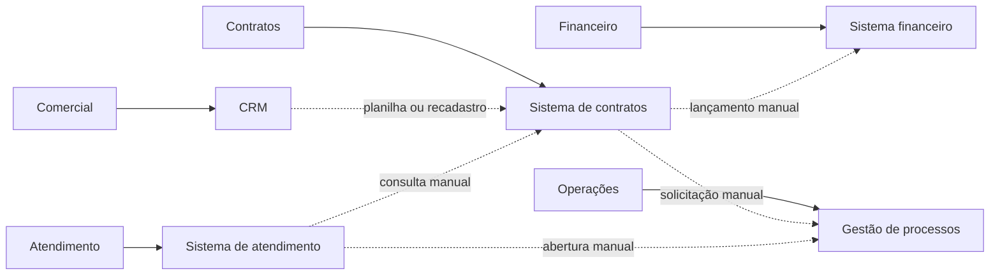

# Arquitetura atual AS IS

## Escopo e origem das informações

O guia permite afirmar como **Confirmado pelo guia** que a organização do
Cenário 4 possui CRM, sistema de contratos, sistema financeiro, sistema de
atendimento e sistema de gestão de processos. O guia também confirma os
problemas gerais de aplicações isoladas, duplicidade de informações,
lançamentos manuais, dependência de sistemas antigos, falta de padronização,
baixa escalabilidade e manutenção difícil.

O guia não identifica produtos, tecnologias, responsáveis, volumes, interfaces
ou sequências operacionais reais. Esses detalhes aparecem neste documento como
**Premissa a validar**. A classificação impede que a modelagem usada na
demonstração seja apresentada como resultado de entrevistas ou observação da
organização.

## Sistemas, setores, usuários e dados

| Sistema | Setores e usuários | Dados produzidos | Dados consumidos | Classificação |
|---|---|---|---|---|
| CRM | Comercial | Cliente, contato, consentimento e oportunidade | Histórico comercial e situação da oportunidade | Sistema: **Confirmado pelo guia**. Setor, usuários e dados: **Premissa a validar**. |
| Sistema de contratos | Jurídico e equipe de contratos | Contrato, itens, vigência, plano e SLA | Cliente e serviço negociado | Sistema: **Confirmado pelo guia**. Setor, usuários e dados: **Premissa a validar**. |
| Sistema financeiro | Financeiro | Cobrança, vencimento, pagamento e inadimplência | Contrato ativo, valor e ciclo de cobrança | Sistema: **Confirmado pelo guia**. Setor, usuários e dados: **Premissa a validar**. |
| Sistema de atendimento | Agentes de atendimento e suporte | Chamado, prioridade, histórico e resolução | Cliente, contrato, serviço e SLA | Sistema: **Confirmado pelo guia**. Setor, usuários e dados: **Premissa a validar**. |
| Sistema de gestão de processos | Operações e gestão | Instância, tarefa, responsável, prazo e estado | Contrato ativo e chamado aberto | Sistema: **Confirmado pelo guia**. Setor, usuários e dados: **Premissa a validar**. |

## Processos principais e dependências

O guia exige que o AS-IS identifique processos e dependências, mas não descreve
como eles ocorrem no Cenário 4. A sequência abaixo constitui **Premissa a
validar** para orientar os três fluxos da demonstração:

1. O comercial cadastra o cliente e registra a oportunidade no CRM.
2. A equipe de contratos recebe os dados da venda e recria ou localiza o
   cliente no sistema de contratos.
3. Após a ativação, o financeiro recebe os dados necessários para criar a
   primeira cobrança.
4. Operações recebe uma solicitação para iniciar o onboarding.
5. O atendimento consulta contrato e SLA antes de classificar o chamado.

Também é **Premissa a validar** que essas transferências usem digitação,
planilhas ou integrações específicas sem contrato uniforme. A representação
abaixo mostra essa hipótese de trabalho, não uma topologia confirmada.

## Problemas e limitações

| Problema ou limitação | Origem | Consequência no Cenário 4 |
|---|---|---|
| Duplicidade de informações e lançamentos manuais | **Confirmado pelo guia** | **Premissa a validar:** um cliente pode receber cadastros e identificadores diferentes nos sistemas. |
| Sistemas sem comunicação adequada e falta de padronização | **Confirmado pelo guia** | **Premissa a validar:** ativação, faturamento e onboarding podem ocorrer em momentos diferentes. |
| Processos fragmentados | **Confirmado pelo guia** | **Premissa a validar:** o atendimento pode consultar contrato ou SLA desatualizado. |
| Dependência de sistemas antigos e dificuldade de integração | **Confirmado pelo guia** | **Premissa a validar:** alterações de formato podem afetar várias integrações específicas. |
| Dificuldade de manutenção e de incorporação de funcionalidades | **Confirmado pelo guia** | **Premissa a validar:** a ausência de contratos versionados dificulta testes e evolução gradual. |
| Baixa escalabilidade | **Confirmado pelo guia** | Volumes e gargalos do Cenário 4 são **Premissa a validar** porque não há medição organizacional. |

## Necessidades de integração

A arquitetura proposta deve responder aos problemas confirmados por meio de:

- identidade global com associação aos identificadores legados;
- contratos de API e de eventos versionados;
- comunicação síncrona para decisões que exigem resposta imediata;
- eventos para propagar fatos confirmados;
- idempotência, auditoria, correlação, tratamento de falhas e reprocessamento;
- fronteiras que mantenham cada sistema como proprietário de seus dados.

Essas necessidades orientam os requisitos e o TO-BE. Produtos, interfaces,
responsáveis, volumes e SLAs reais continuam como **Premissa a validar** com o
professor ou representante da organização.
