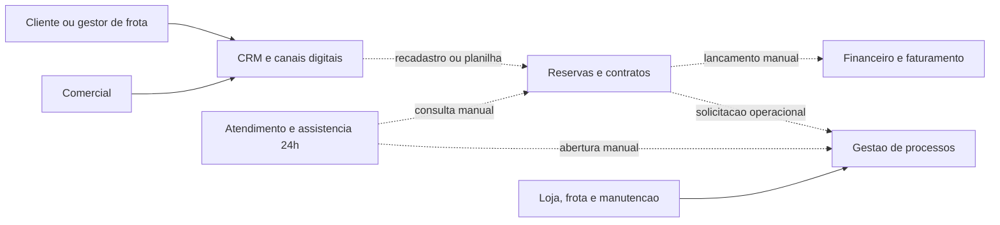

# Arquitetura Atual AS-IS - Localiza

> Estado de execução em 27/09/2026: consulte [Estado da implementação](../ESTADO_IMPLEMENTACAO.md) e [Cronograma executável](../CRONOGRAMA_EXECUCAO.md). As seções de desenho abaixo incluem metas futuras e premissas acadêmicas; o código e os testes são a evidência do comportamento atual.

## Escopo e Origem das Informacoes

O `Guia.pdf` confirma para o Cenario 4 cinco sistemas: CRM, contratos,
financeiro, atendimento e gestao de processos. Para este projeto, esses sistemas
foram contextualizados na Localiza como CRM/canais digitais, reservas e contratos
de locacao, financeiro e faturamento, atendimento e assistencia 24h e gestao de
processos operacionais.

O guia tambem confirma problemas gerais: duplicidade de informacoes, sistemas
sem comunicacao adequada, lancamentos manuais, dificuldade de integracao,
dependencia de sistemas antigos, dificuldade de manutencao, baixa escalabilidade,
falta de padronizacao e processos fragmentados.

Produtos internos, tecnologias, filas, bancos, APIs reais, volumes, SLAs e
responsaveis nao foram fornecidos. Esses pontos sao **Premissa a validar**.

## Sistemas, Setores, Usuarios e Dados

| Sistema | Setores e usuarios | Dados produzidos | Dados consumidos | Classificacao |
|---|---|---|---|---|
| CRM e canais digitais | Comercial, clientes e gestores de frota | Cliente, contato, consentimento, perfil de locacao e oportunidade | Historico comercial e preferencias | Sistema confirmado pelo guia; dominio Localiza como premissa academica. |
| Reservas e contratos de locacao | Operacao de reservas, loja/agencia e area de contratos | Reserva, contrato, grupo de veiculo, periodo, protecoes, condutor e SLA | Cliente e condicoes comerciais | Sistema confirmado pelo guia; detalhes reais a validar. |
| Financeiro e faturamento | Financeiro, cobranca e contas a receber | Fatura, pagamento, caucao, multas, adicionais e inadimplencia | Contrato ativo, valor, periodo e cliente | Sistema confirmado pelo guia; regras reais a validar. |
| Atendimento e assistencia 24h | Atendimento, assistencia e suporte operacional | Chamado, categoria, prioridade, historico e resolucao | Cliente, contrato, grupo de veiculo, protecoes e SLA | Sistema confirmado pelo guia; produtos reais a validar. |
| Gestao de processos operacionais | Operacoes, loja/agencia, frota, manutencao e gestao | Tarefa, responsavel, prazo, retirada, devolucao, vistoria e manutencao | Contrato ativo e chamado aberto | Sistema confirmado pelo guia; workflow real a validar. |

## Processos Principais e Dependencias

1. Cliente ou gestor de frota e cadastrado ou atualizado no CRM.
2. Reserva/contrato de locacao e criada a partir da oportunidade ou solicitacao.
3. Na ativacao/retirada, o financeiro precisa iniciar cobranca ou
   pre-autorizacao.
4. A operacao precisa preparar veiculo, retirada, devolucao e eventuais
   vistorias.
5. Atendimento e assistencia 24h precisam consultar contrato, protecoes e SLA
   antes de classificar uma ocorrencia.

```mermaid
flowchart LR
  Cliente[Cliente ou gestor de frota] --> CRM[CRM e canais digitais]
  Comercial[Comercial] --> CRM
  CRM -. recadastro ou planilha .-> CT[Reservas e contratos]
  CT -. lancamento manual .-> FI[Financeiro e faturamento]
  CT -. solicitacao operacional .-> BPM[Gestao de processos]
  Atendimento[Atendimento e assistencia 24h] -. consulta manual .-> CT
  Atendimento -. abertura manual .-> BPM
  Operacao[Loja, frota e manutencao] --> BPM
```

## Problemas e Limitacoes

| Problema | Consequencia no caso Localiza |
|---|---|
| Duplicidade de informacoes | Cliente, empresa, contrato e atendimento podem usar identificadores diferentes. |
| Lancamentos manuais | Ativacao da locacao pode nao disparar cobranca e preparacao de retirada no mesmo momento. |
| Falta de padronizacao | Canais, reservas, faturas e chamados podem trocar dados com formatos diferentes. |
| Processos fragmentados | Atendimento pode abrir ocorrencia sem confirmar contrato, protecao ou SLA. |
| Dependencia de legados | Mudancas em formatos ou regras podem exigir manutencao em varios pontos. |
| Baixa rastreabilidade | Falha entre reserva, faturamento e atendimento pode demorar a ser localizada. |

## Necessidades de Integracao

- Identidade global de cliente com mapeamento de IDs legados.
- Contratos OpenAPI/AsyncAPI para REST e eventos.
- REST para decisoes imediatas: criar reserva, consultar elegibilidade e
  reconciliar chamado.
- Eventos para fatos confirmados: cliente atualizado, contrato ativado e chamado
  aberto.
- Idempotencia, outbox, inbox, auditoria, correlacao e reprocessamento.
- Fronteiras claras para que cada sistema continue dono de seus dados.
