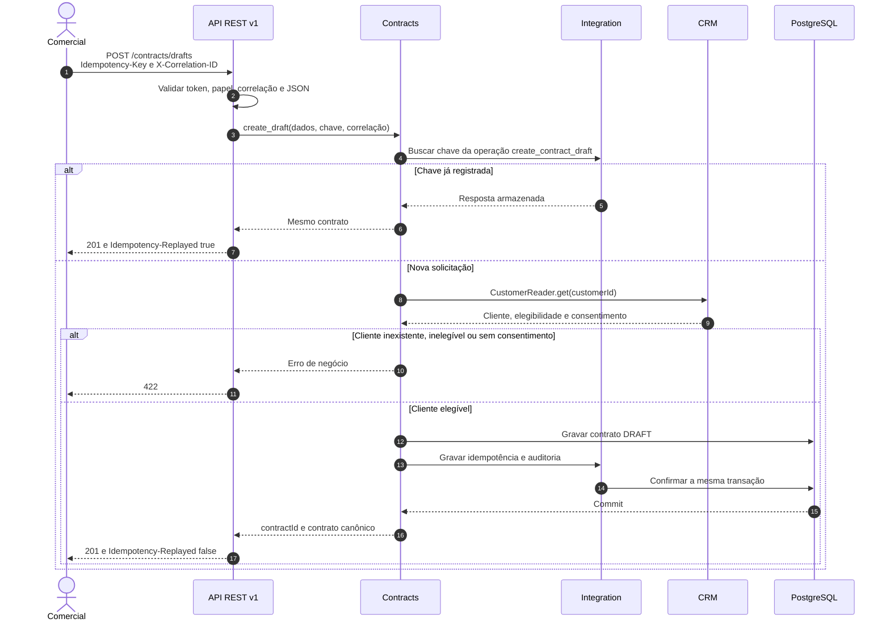
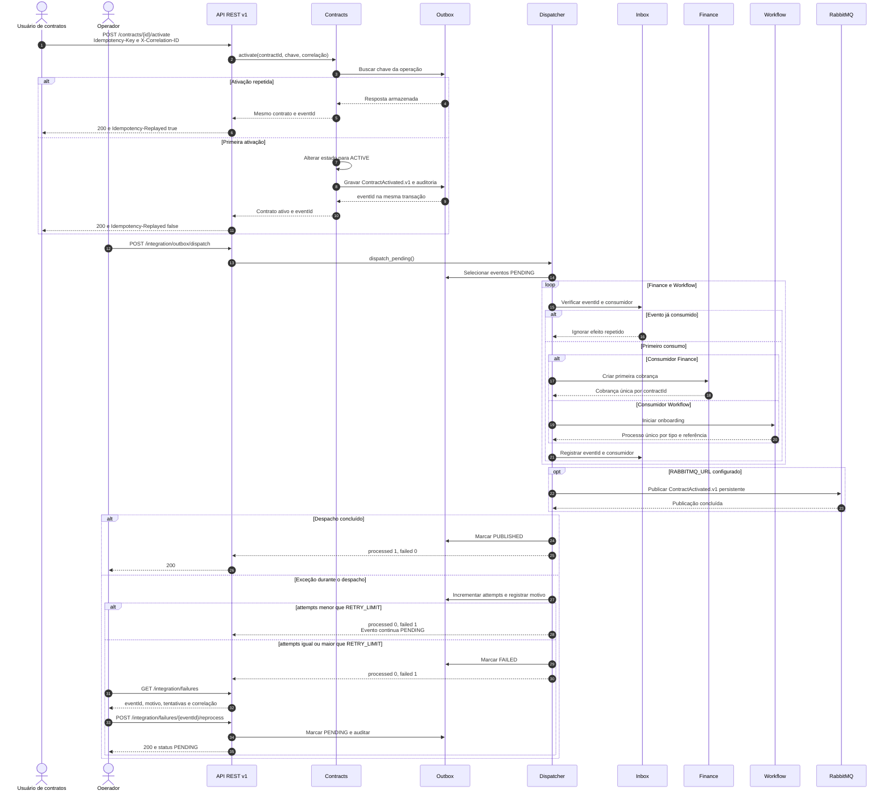
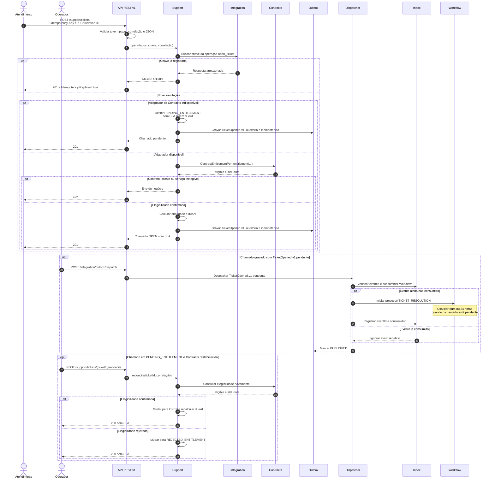

# Fluxos de integração

Os diagramas abaixo representam o comportamento implementado para F1, F2 e F3.
Eles complementam `docs/INTEGRACOES.md` e usam os contratos de
`docs/api/openapi.yaml` e `docs/events/asyncapi.yaml`. Os payloads completos estão
em `docs/EXEMPLOS_API.md`.

## Convenções

- Linha contínua representa chamada ou gravação síncrona.
- Linha tracejada representa resposta.
- Outbox registra o fato junto com a transação de negócio.
- Inbox registra o par formado por `eventId` e consumidor.
- `X-Correlation-ID` acompanha HTTP, auditoria e eventos.
- `Idempotency-Key` identifica uma operação mutável repetível.

## F1: cliente do CRM para contrato

O fluxo cria um rascunho usando o cliente oficial do CRM. A consulta ocorre pela
porta pública `CustomerReader`, sem acesso ao banco ou ao modelo interno do CRM.

Erros de autenticação, autorização ou correlação são encerrados na API com `401`,
`403` ou `400`, antes de Contracts executar o caso de uso. O adaptador interno de
CRM não simula indisponibilidade ou timeout neste fluxo.

## F2: ativação, cobrança e onboarding

O fluxo separa a confirmação síncrona da ativação dos efeitos assíncronos em
Finance e Workflow. A ativação e o registro da outbox pertencem à mesma transação.

Cada chamada ao dispatcher realiza uma tentativa. O protótipo não possui
agendador, atraso exponencial ou jitter. O operador precisa chamar o despacho
novamente após corrigir a causa. A inbox e as restrições únicas permanecem ativas
no reprocessamento.

## F3: chamado com contrato e SLA

Support consulta o contrato pela porta `ContractEntitlementPort`. O estado
pendente preserva a solicitação quando o adaptador está indisponível.

`TicketOpened.v1` nunca contém a descrição. A reconciliação atualiza o chamado e a
auditoria, mas não publica outro evento e não recalcula o prazo do processo já
iniciado em Workflow.

## Rastreabilidade operacional

Depois de qualquer fluxo, o operador usa
`GET /api/v1/operations/{correlationId}`. A resposta reúne auditorias e eventos
gravados com a mesma correlação. O endpoint não agrega registros que receberam
outro `X-Correlation-ID`, mesmo quando pertencem à mesma demonstração.

Os diagramas descrevem o protótipo acadêmico. Produtos, interfaces e topologia dos
sistemas reais continuam como premissas a validar com a organização.
