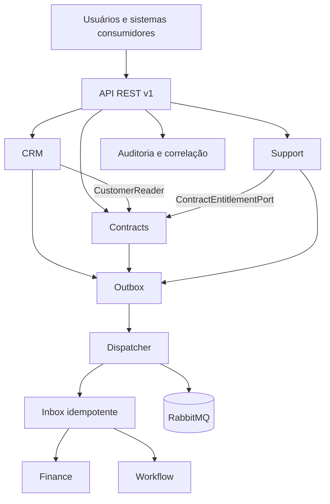
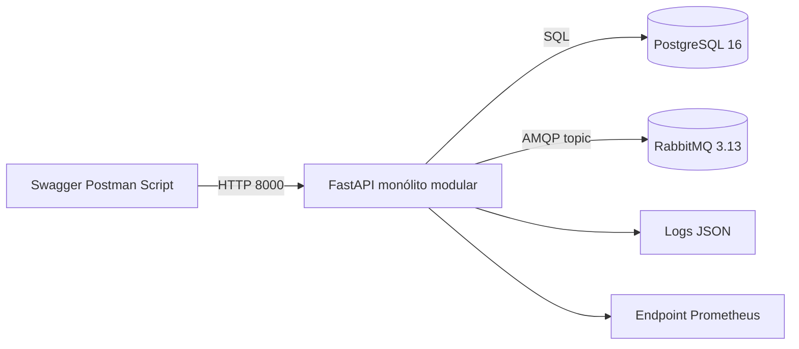

# Arquitetura proposta TO BE

## Escopo da proposta

O TO-BE aplica a decisão do ADR-001: uma SOA pragmática entregue inicialmente
como monólito modular. Os contextos executam no mesmo processo, mas preservam
regras, dados e interfaces públicas próprias. Dentro de cada contexto, a
arquitetura hexagonal mantém domínio e casos de uso independentes de HTTP,
banco, broker e sistemas externos.

Esta é uma **Proposta definida** para o protótipo acadêmico. Produtos legados,
interfaces existentes, topologia de produção, volumes e responsáveis permanecem
como **Premissa a validar** com a organização. Uma validação incompatível com os
direcionadores do ADR exige nova decisão arquitetural.

## Usuários e sistemas consumidores

| Consumidor | Necessidade atendida | Acesso proposto |
|---|---|---|
| Comercial | Cadastrar cliente e criar contrato sem recadastro | API CRM e criação de rascunho |
| Contratos | Elaborar, ativar e consultar contrato e SLA | API Contracts |
| Financeiro | Receber contrato ativo e criar cobrança | Consumidor de evento |
| Atendimento | Abrir chamado com elegibilidade e SLA | API Support e consulta pública de Contracts |
| Operações e gestão | Iniciar e acompanhar processos e falhas | Consumidores de eventos e APIs operacionais |
| Sistemas externos | Integrar capacidades sem conhecer tabelas internas | Adaptadores, REST/JSON e eventos versionados |

Os papéis organizacionais específicos são **Premissa a validar**. A tabela
representa os consumidores necessários para demonstrar o cenário.

## Visão lógica

CRM, Contracts, Finance, Support e Workflow mantêm regras de negócio. Integration
traduz, roteia, correlaciona e controla a entrega, mas não decide elegibilidade,
SLA, cobrança, prioridade ou estado dos processos.

## Componentes, serviços, APIs e dados

| Contexto | Serviços e casos de uso | Interface pública | Dados oficiais | Persistência do protótipo |
|---|---|---|---|---|
| CRM | Cadastro, atualização, elegibilidade e consentimento | API CRM e `CustomerReader` | Cliente, contatos, consentimentos e oportunidade | `crm_customers` |
| Contracts | Rascunho, ativação, plano, vigência e SLA | API Contracts e `ContractEntitlementPort` | Contrato, itens, vigência, plano e SLA | `contracts_contracts` |
| Finance | Criação da primeira cobrança | Consumidor de `ContractActivated.v1` | Cobrança, vencimento, pagamento e inadimplência | `finance_invoices` |
| Support | Abertura, prioridade, prazo e reconciliação de chamado | API Support | Chamado, prioridade, histórico e resolução | `support_tickets` |
| Workflow | Onboarding e processo de resolução | Consumidores de eventos | Instância, tarefa, responsável, prazo e estado | `workflow_instances` |
| Integration | IDs legados, correlação, outbox, inbox, auditoria e falhas | APIs operacionais e dispatcher | Mapeamentos, correlação e registros de entrega | tabelas `integration_*` |

A API pública usa o prefixo `/api/v1`. O OpenAPI documenta as operações HTTP,
e o AsyncAPI documenta `CustomerUpdated.v1`, `ContractActivated.v1` e
`TicketOpened.v1`. Mudanças compatíveis adicionam campos opcionais; mudanças
incompatíveis criam nova versão.

## Fluxo de informações

1. **F1 — cliente para contrato:** o CRM fornece o `customerId` global e
   Contracts cria o rascunho por uma operação REST idempotente.
2. **F2 — ativação, cobrança e onboarding:** Contracts registra a ativação e a
   outbox na mesma transação. Finance e Workflow consomem o evento com inbox e
   restrições contra duplicidade.
3. **F3 — chamado com SLA:** Support consulta a porta pública de Contracts,
   registra o chamado e publica o fato para Workflow. Indisponibilidade preserva
   a solicitação para reconciliação posterior.

A documentação de integração detalha origem, destino, payloads, respostas e
tratamento de erros. Este documento mantém apenas o fluxo arquitetural e as
fronteiras.

## Fronteiras e consistência

- Cada contexto acessa apenas suas próprias tabelas e expõe interfaces públicas.
- A consistência é forte dentro da transação de um contexto e eventual entre
  contextos.
- A fonte oficial prevalece em divergências; o sistema registra a inconsistência
  em vez de aplicar última escrita vence.
- A outbox preserva o fato antes da publicação, e a inbox registra o
  `eventId` processado por consumidor.
- O `correlationId` atravessa HTTP, logs, auditoria, eventos e registros de
  falha.
- Adaptadores substituíveis isolam formatos e tecnologias dos sistemas externos.

## Implantação do protótipo

O Docker Compose inicia API, PostgreSQL e RabbitMQ. Os testes usam SQLite para
reduzir o tempo de execução e verificam as regras e restrições principais. O
servidor PostgreSQL único atende apenas ao protótipo; as fronteiras lógicas
proíbem leitura direta de tabelas de outro contexto.

Credenciais separadas, capacidade, alta disponibilidade e distribuição física
dependem da topologia real e são **Premissa a validar**. A proposta não inclui
Kubernetes, service mesh, múltiplos bancos físicos ou decomposição completa em
microsserviços sem requisito mensurável e novo ADR.

## Justificativa, vantagens e limitações

O monólito modular reduz a carga operacional para a equipe e para a demonstração
sem abandonar contratos de serviço, propriedade de dados ou portas hexagonais.
REST oferece resposta imediata quando o fluxo precisa decidir; eventos desacoplam
efeitos posteriores e permitem reentrega idempotente.

A escolha tem limitações. O processo e a implantação formam uma única unidade,
um uso incorreto das interfaces pode aumentar o acoplamento e a mensageria exige
operação, observabilidade e tratamento de falhas. A extração de um contexto só
se justifica quando métricas demonstrarem necessidade independente de escala,
disponibilidade, tecnologia ou ritmo de mudança.

## Segurança, privacidade e operação

O adaptador local simula tokens OIDC e aplica papéis por rota. A substituição por
um provedor real preserva a porta de autenticação. A API valida entradas,
minimiza dados compartilhados e não inclui a descrição do chamado nos eventos.
Logs não devem registrar tokens, senhas, documentos completos, dados bancários
ou conteúdo sensível. TLS é obrigatório fora da demonstração local.

Health checks distinguem processo vivo de dependências prontas. Logs
estruturados, métricas, auditoria e correlação permitem localizar falhas. Após o
limite de tentativas, uma falha permanente preserva motivo, payload seguro e
correlação para reprocessamento explícito e auditável.
