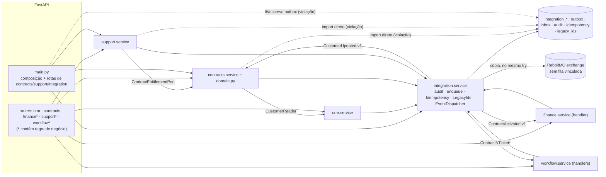

# Auditoria de arquitetura e progresso: Projeto Aplicado 7 (Cenário 4)

| Item | Valor |
|---|---|
| Referência auditada | `main` = `3a3d8bd` ("Sprint Q3 · APIs e fundação (T06–T09) (#28)"), árvore limpa |
| Congelamento | 01/10/2026 20:35 UTC |
| Execuções e consultas | 01/10/2026, 20:35–21:20 UTC |
| Consolidação | 03/10/2026 |
| Organização | coordenador + 3 agentes em duas ondas (investigação e revisão cruzada) |
| Alterações feitas | nenhuma em código, contratos, tickets ou publicação; a única escrita é este pacote |

Este parecer separa cinco categorias de informação:

- comportamento **comprovado** (executado nesta auditoria);
- **declaração documental** (está escrito, mas não foi verificado);
- **decisão aprovada** (registrada em ADR);
- **hipótese** (premissa a validar);
- **evolução futura** (meta).

## 1. Estado auditado e limitações de partida

1. **A ref planejada não existe no remoto.** O plano citava a branch `execucao-tarefas-pendentes`, HEAD `3fdb533`, com 13 commits sobre `3a3d8bd`. Essa ref não está no remoto (`git ls-remote`) nem no clone (`git cat-file` falha). O trabalho é apenas local do autor, não está publicado e não pôde ser auditado (AUD-50). A auditoria cobre `3a3d8bd`.
2. **Outras refs do remoto:**
   - `origin/claude/sprint-3-4-status-3mbie4`: PR #29, rascunho, refatoração e docstrings, CI verde.
   - `origin/ccr-1c5dff06-gdznnu`: auditoria de 29/09, sem PR.
   - Branches antigas já mescladas.
3. **Alterações locais e arquivos não rastreados:** nenhum no clone auditado.
4. **Enunciado:** o arquivo "Projeto Aplicado – Localiza_ Arquitetura de Sistemas Corporativos.pdf", apontado como fonte nº 1 em `AGENT.md:39`, não está no repositório e não foi encontrado no Drive nem no Notion. A fonte primária usada foi o `Guia.pdf` (ArchCorp, Cenário 4 "Empresa de serviços"). A Localiza é uma contextualização escolhida pela equipe (AUD-16).
5. **Ambiente:**
   - Docker: sem daemon, portanto build de imagem e Compose não foram executados localmente; o `docker build` foi comprovado só no CI.
   - RabbitMQ: ausente; foi simulado com porta fechada e host sem resposta.
   - PostgreSQL 16: descartável, local.
   - Render, Supabase, Notion, Drive e GitHub Project: inacessíveis ou não localizados.

## 2. Parecer por área

### 2.1 Arquitetura

**Conclusão: adequada ao protótipo acadêmico e sustentável, com dívida localizada.**

**Comprovado:**

- **Estrutura:** um monólito modular com seis contextos (`crm`, `contracts`, `finance`, `support`, `workflow`, `integration`).
- **Dependências:** não há ciclos de import, e nenhum contexto de negócio importa `models` de outro contexto de negócio.
- **Portas entre contextos:** `CustomerReader` e `ContractEntitlementPort`.
- **Outbox:** gravada na mesma transação da mudança de negócio.
- **Inbox:** com restrição única `(event_id, consumer)`.
- **Integration:** não contém regra de negócio de Finance nem de Workflow. A crítica de que funcionaria como um ESB não se confirma.

**Decisão aprovada** (ADR-001, ADR-002): uma SOA pragmática entregue como monólito, com migrações aditivas. O código segue essa decisão. Não há necessidade demonstrada de microsserviços, e o próprio `AGENT.md` os desaconselha sem requisito mensurável.

**Dívida e violações:**

- **Hexagonal parcial (AUD-06):** as portas recebem `Session`; regras de negócio estão nas rotas de `finance`, `support` e `workflow`; `pika` é usado sem adaptador; `main.py` tem 619 linhas e mistura composição com rotas de três contextos.
- **Fronteira violada (AUD-22):** Contracts e Support importam `integration.models.IdempotencyRecord`, e `main.py` lê e altera `OutboxEvent`/`AuditLog`. O teste de arquitetura exclui `integration` e só reconhece uma forma de import; detectou 1 de 8 violações sintéticas.
- **Documentação desatualizada (AUD-13):** TO-BE e DDD citam 3 eventos (o AsyncAPI tem 6) e uma tabela por contexto (são 16).

Mapa implementado (detalhe em `evidencias/agente2/mapa_arquitetural.md`):

### 2.2 Comportamento: fluxos F1–F3, dados e contratos

**Comprovado:**

- **Suíte e contrato:** 57/57 testes em Python 3.11 e 3.12 (SQLite) e 57/57 em PostgreSQL, este com `conftest` alterado; `export_openapi --check` byte-idêntico, 49 operações para 49 rotas.
- **F1:** cliente → reserva → rascunho sem recadastro. Mesma `Idempotency-Key` gera replay, payload diferente retorna 409 e cliente inativo retorna 422.
- **F2:** a ativação gera fatura e processo de preparação por evento. Reativação, duplo despacho, reentrega e reprocessamento sequenciais não duplicam efeitos, e sob concorrência em PG houve 0 faturas, processos ou inbox duplicados.
- **F3:** consulta de contrato/SLA, abertura do chamado, processo de resolução e conclusão; pendência de elegibilidade com reconciliação.
- **Migrações:** banco vazio → head, banco legado 0001 com dados → head (dados e unicidades preservados) e downgrade→upgrade, em SQLite e PG.
- **Interface:** jornada completa no navegador (Playwright) com o backend real sobre PG local.

**Defeitos e riscos principais:**

- **AUD-01 (alta):** um erro de banco num consumidor deixa a sessão sem `rollback`. O despacho responde 500, o evento nunca chega a FAILED e a outbox inteira trava. Gatilho real observado: o despacho concorrente (AUD-11) gera um 500 transitório. O bloqueio permanente foi reproduzido com evento injetado.
- **AUD-05:** com o broker opcional fora do ar, o evento é marcado FAILED depois que os efeitos internos já foram gravados, com motivo vazio, e cada evento custa 10–15 s.
- **AUD-04:** reprocessar um evento antigo sobrescreve a projeção mais nova ("última escrita vence"). Hoje só se materializa com falha injetada e se torna alcançável quando AUD-01 for corrigido.
- **AUD-10:** ativação concorrente, ou duplo clique na interface, gera 2 `ContractActivated.v1` para o mesmo contrato. Cobrança e processo não duplicam porque as restrições únicas seguram.
- **Dinheiro:**
  - AUD-09: o pagamento aceita frações de centavo, e em PG um pagamento de 100.095 deixa a fatura OPEN com saldo zero.
  - AUD-35: `amount` ≥ 10^12 dá 500 em PG.
  - AUD-20, AUD-21: o valor monetário sai como string em umas rotas e número em outras, e o `Money` do AsyncAPI rejeita 19,99.
- **Encerramento e Workflow:** o encerramento do contrato não se propaga a Finance e Support (AUD-28); o Workflow não tem máquina de estados de tarefa (AUD-30); a inadimplência é só calculada na leitura (AUD-29).
- **Diferenças SQLite × PostgreSQL:** AUD-35, AUD-09, AUD-33 e AUD-41 só aparecem num dos bancos; a suíte e o CI usam apenas SQLite (AUD-36).

### 2.3 Qualidade, segurança e operação

**Comprovado:**

- O segredo do modo público é imposto na inicialização: token curto ou com prefixo `demo-` é recusado e `demo-admin` recebe 401.
- A comparação usa `compare_digest`.
- Não há token nos logs nem segredo no histórico Git.
- RLS e REVOKE estão ativos nas 16 tabelas do modelo em PG.
- O p95 de `/health/ready` ficou entre 11 e 14 ms (meta < 500 ms); medição complementar de F1–F3: p95 de 39 a 51 ms.
- `npm audit`: 0 vulnerabilidades.
- CI `Verify` verde em `3a3d8bd`, inclusive `docker build`.

**Defeitos e riscos (todos de severidade média, salvo indicação):**

- **AUD-23:** `alembic_version` e as sequências ficam expostas a `anon`. Com os privilégios padrão do Supabase simulados, `anon` impede a inicialização da aplicação.
- **AUD-24:** `/metrics` é público e tem cardinalidade ilimitada.
- **AUD-25:** starlette 0.47.3 tem 7 advisories; um pedido de Range de 7,6 s degrada a aplicação.
- **AUD-32:** os logs JSON descartam a exceção.
- **AUD-34:** a credencial pública recebe todos os papéis.
- **AUD-26:** o frontend gera uma chave de idempotência nova a cada clique, apaga o formulário após erro e só funciona com o perfil admin.
- **AUD-27:** contraste insuficiente (axe, *serious*).
- **AUD-36:** o CI não testa PG, concorrência, acessibilidade nem o desempenho de F1–F3, e o teste de RLS usa uma conexão falsa.
- **Itens de severidade baixa:** cabeçalhos de segurança ausentes, e-mail no log de acesso e dependências transitivas sem lock.
- **Observabilidade:** logs estruturados, métricas e health checks são comprovados. Tracing distribuído, fila de erro no broker, OIDC e escala horizontal **não existem** e são metas. Os documentos que os apresentam como atendidos estão em AUD-08 e AUD-37.

### 2.4 Publicação

**Conclusão: não atendida.**

Não há URL HTTPS, health check remoto nem persistência remota (issue #23 aberta). Existe o equivalente local: PG + reinício + `/health/ready`. Antes de publicar, é preciso resolver AUD-23, AUD-24 e AUD-25 (ações P-11..P-13).

### 2.5 Prontidão acadêmica

O Guia define nove itens. A documentação Markdown cobre a maior parte deles: AS-IS, RF/RNF, TO-BE, ADR, três integrações, nove atributos de qualidade, evolução e negócio.

**Entregáveis finais (risco acadêmico principal):**

- **Relatório técnico:** tem erros factuais (AUD-02); não tem figuras nem integrantes; a fundamentação está incompleta; atinge 18 páginas com só 2.726 palavras (AUD-03); é anterior a T06–T09 (AUD-13).
- **Apresentação:** não tem os tópicos de APIs e manutenção, nem a equipe (AUD-17).

**Progresso declarado:**

- T01–T05 aparecem como "Concluído" no Jira, no GitHub e no Trello sem o aceite que o próprio critério exige (AUD-07).
- A matriz de rastreabilidade superestima a cobertura (AUD-08).
- As contagens de testes divergem entre documentos: 13, 17, 18 e 57 (AUD-14).

## 3. Atendimento T01–T22

Detalhe em `MATRIZ_T01_T22.md`.

| Classificação | Tarefas |
|---|---|
| Comprovado | T02, T04 (documental); T08, T11, T15 (executado) |
| Parcial | T01, T03, T05, T06, T07, T09, T10, T12, T13, T14, T16, T17, T18, T21 |
| Não atendido | T19 (relatório e slides), T20, T22 (prazos ainda não vencidos) |
| Não verificado | partes de T21 (Notion, Drive, GitHub Project) |

Até 01/10, último dia de S4, venceram T01–T05: duas comprovadas documentalmente e três parciais. As demais estão dentro do prazo interno.

## 4. Achados e plano

- **Achados:** 50 consolidados (`REGISTRO_ACHADOS.md`): **0 críticos, 3 altos, 34 médios, 11 baixos e 2 informativos**. Todos os achados com severidade inicial alta passaram por revisão de um agente diferente do autor. Cinco foram rebaixados para média, com justificativa registrada, e não restaram divergências sem resolução.
- **Tipos:** **defeitos demonstrados**, como AUD-01, AUD-09, AUD-10 e AUD-11, ficam separados de **riscos** (AUD-23, AUD-25, AUD-34), de **dívida técnica** (AUD-06, AUD-22, AUD-36) e de **metas futuras** (AUD-19, AUD-28 em parte, AUD-42).
- **Plano:** `PLANO_ACAO.md` traz 35 ações em seis ondas. A ordem crítica é publicar o trabalho local (P-01), corrigir o status (P-02/P-03), corrigir o despachante (P-04 → P-05/P-07), fechar a CI em PG (P-17), publicar (P-16) e só então regenerar relatório e slides (P-27/P-28), para que descrevam o estado corrigido.

## 5. Critérios de conclusão desta auditoria

| Critério | Situação |
|---|---|
| 22 tarefas com avaliação explícita | Atendido (`MATRIZ_T01_T22.md`) |
| Áreas arquiteturais avaliadas (módulos, dados, contratos, confiabilidade, fluxos, segurança, operação, entregas) | Atendido (seção 2) |
| Achados de severidade alta com revisão independente | Atendido (fichas em `REGISTRO_ACHADOS.md`; `evidencias/agente*/revisao_cruzada.md`) |
| Cada conclusão com evidência ou limitação registrada | Atendido (`EVIDENCIAS.md`) |
| Nenhuma alteração fora do pacote | Atendido (`git status` limpo fora de `output/auditoria/`; manifesto SHA-256 da cópia isolada conferido antes e depois) |
