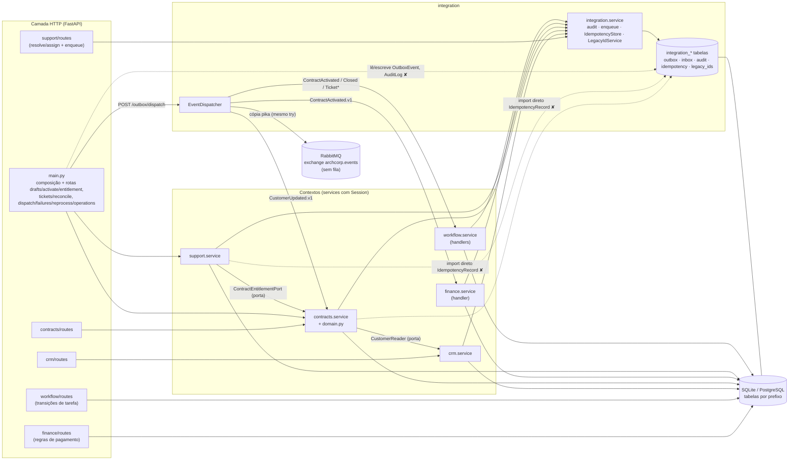

# Mapa arquitetural real — `3a3d8bd`

Fonte: análise AST (`$SP/agente2/imports_ast.py`, E2-01/E2-02), leitura de `src/archcorp/**` e experimentos E2-03..E2-18. Diferencia o **implementado** (este mapa) do **desenhado** (ADR-001, TO-BE).

## 1. Módulos e responsabilidades efetivas

| Módulo | Arquivos (linhas) | Responsabilidade real | Dependências de framework |
|---|---|---|---|
| `crm` | models 34, public 18, service 185, routes 237 | Cliente/contato/oportunidade; publica `CustomerUpdated.v1`; implementa `CustomerReader.get` | SQLAlchemy (service, porta), FastAPI/Pydantic (routes) |
| `contracts` | domain 49, models 43, public 7, service 232, routes 273 | Reserva, contrato, máquina de estados (`domain.py`, sem framework), ativação/encerramento com outbox, projeção de cliente (consumidor), `entitlement` | SQLAlchemy (service, porta `ContractEntitlementPort` com `Session`) |
| `finance` | models 29, service 25, routes 147 | Handler de `ContractActivated.v1`; **regras de pagamento/quitação/inadimplência nas rotas** | SQLAlchemy; FastAPI nas regras |
| `support` | models 27, service 77, routes 96 | Abertura/reconciliação no service; **resolução/atribuição nas rotas** (com `enqueue`/`audit`) | SQLAlchemy; FastAPI nas regras |
| `workflow` | models 29, service 79, routes 141 | Handlers de 5 eventos; **transições de tarefa nas rotas** | SQLAlchemy; FastAPI nas regras |
| `integration` | models 79, service 130 | Outbox, inbox, auditoria, idempotência, IDs legados, `EventDispatcher` (inclui publicação `pika`) — **sem regra de negócio dos contextos** | SQLAlchemy, `pika` direto |
| `infrastructure` | db 34, migrate 54, migrations | Engine/Session, RLS PostgreSQL público, Alembic | SQLAlchemy, Alembic |
| `main.py` | 619 | Composição (instancia serviços e mapa de consumidores) **e** rotas de Contracts (drafts/activate/entitlement), Support (tickets/reconcile), Integration (dispatch/failures/reprocess/legacy-ids/operations), health, metrics, demo | FastAPI, SQLAlchemy |
| `security.py` | 42 | Tokens fixos de demonstração/segredo público → papéis | FastAPI |
| `observability.py` | 47 | Log JSON, contadores em memória, `correlation_id_var` | FastAPI |
| `errors.py` / `exceptions.py` | 217 / 41 | `problem+json`; exceções de domínio sem HTTP | FastAPI / nenhuma |
| `schemas.py` | 297 | Schemas Pydantic e exemplos compartilhados (CRM, contratos, tickets, integração) | Pydantic |

Concentração: `integration/service.py` **não** contém regra de Finance/Workflow (a crítica do ESB não se confirma). A concentração indevida está em `main.py` (rotas de três contextos + lógica de reprocessamento) e nas rotas de `finance`, `support` e `workflow` (regras de negócio na camada HTTP).

## 2. Dependências de import entre contextos (implementadas)

| De | Para | Símbolos | Conformidade |
|---|---|---|---|
| contracts.service | crm.public | `CustomerData`, `CustomerReader` | ✔ porta pública |
| support.service | contracts.public | `ContractEntitlementPort` | ✔ porta pública |
| contracts.service | **integration.models** | `IdempotencyRecord` | ✘ modelo interno (AGENT.md, ADR-001 r.13) |
| support.service | **integration.models** | `IdempotencyRecord` | ✘ modelo interno |
| crm.service, contracts.service, support.service/routes, finance.service, workflow.service | integration.service | `audit`, `enqueue`, `LegacyIdService`, `IdempotencyStore` | ~ kernel compartilhado (aceitável, mas não declarado como interface pública) |
| main | **integration.models** | `AuditLog`, `OutboxEvent` (consulta e altera) | ✘ composição lê/escreve tabela interna |
| main | crm.service, contracts.service/routes, finance.service/routes, support.service/routes, workflow.service/routes | serviços, handlers, routers | ✔ composição |

Ciclos de import: **nenhum** (Integration não importa contextos; contextos não se importam mutuamente fora das portas). Nenhum contexto de negócio importa `models` de outro contexto de negócio.

## 3. Propriedade e acesso a tabelas (leitura R / escrita W)

| Tabela | Proprietário | Quem acessa (código) |
|---|---|---|
| `crm_customers`, `crm_contacts`, `crm_opportunities` | CRM | CRM (R/W). Contracts lê **somente** via `CustomerReader` (implementado por `CustomerService.get`) |
| `contracts_contracts`, `contracts_reservations` | Contracts | Contracts (R/W, inclusive projeção `customer_name/email` via consumidor). Support lê via `ContractEntitlementPort` |
| `finance_invoices`, `finance_payments` | Finance | Finance (R/W) |
| `support_tickets`, `support_assignments` | Support | Support (R/W) |
| `workflow_instances`, `workflow_tasks` | Workflow | Workflow (R/W) |
| `integration_outbox` | Integration | W: crm/contracts/support via `enqueue`; R/W: dispatcher; **R/W: main.py** (failures, reprocess, operations) |
| `integration_inbox` | Integration | dispatcher (R/W) |
| `integration_audit` | Integration | W: todos via `audit`; R: main.py (operations) |
| `integration_idempotency` | Integration | W/R: `IdempotencyStore` (draft, reserva, close) **e diretamente** contracts (`activate`, `close` sem chave) e support (`open_ticket`) |
| `integration_legacy_ids` | Integration | CRM via `LegacyIdService`; main.py via `LegacyIdService` |

Não foi encontrado SQL textual nem leitura de tabela de outro contexto de negócio.

## 4. Eventos: produtores e consumidores (dispatcher, `main.py:340-347`)

| Evento | Produtor (transação) | Consumidores internos (inbox) | AsyncAPI |
|---|---|---|---|
| `CustomerUpdated.v1` | crm.service.update (nome/e-mail) | `contracts-customer-projection` | ✔ |
| `ContractActivated.v1` | contracts.service.activate | `finance`, `workflow-preparacao-retirada` | ✔ |
| `ContractClosed.v1` | contracts.service.close | `workflow-encerramento-contrato` (Finance ausente — pendência T12) | ✔ |
| `TicketOpened.v1` | support.service.open | `workflow-ticket-resolution` | ✔ |
| `TicketEntitlementReconciled.v1` | support.service.reconcile | `workflow-ticket-entitlement` | ✔ |
| `TicketResolved.v1` | **support.routes.resolve_ticket** | `workflow-ticket-resolution-complete` | ✔ |

Todos os produtores gravam a outbox na mesma sessão/commit da mudança (atomicidade confirmada em E2-17). Nenhum evento documentado sem produtor/consumidor; `causationId` nunca preenchido. Broker: cópia publicada na exchange `archcorp.events` após os consumidores internos, sem fila vinculada no código.

## 5. Diagrama (implementado)

## 6. Comparação com ADR-001 / TO-BE / hexagonal

| Regra | Situação |
|---|---|
| Monólito modular com seis contextos | ✔ implementado |
| Nenhum módulo lê/escreve esquema interno de outro (r.2, r.13) | Parcial: respeitado entre contextos de negócio; violado com `integration.models` (contracts, support, main) |
| REST para resposta imediata; eventos para fatos | ✔ |
| Outbox transacional; inbox por consumidor | ✔ gravação atômica; ✘ despacho sem isolamento por consumidor, sem lock (A2-01/05/07) |
| Erro permanente → fila de não processados com reprocessamento auditado (r.8, r.12) | Parcial: estado `FAILED` na própria outbox (sem DLQ no broker — meta declarada); auditoria sem solicitante; erro de banco nunca chega a `FAILED` |
| `Idempotency-Key` combina chave e operação e devolve resposta original (r.11) | Parcial: três implementações; em ativação o escopo inclui o `contractId`; ticket compara 4 campos |
| Adaptadores substituíveis para externos (r.10) | Parcial: portas internas existem; broker acoplado via `pika` no dispatcher; "indisponibilidade de Contracts" simulada por flag global |
| Hexagonal (domínio/casos de uso sem HTTP/banco/broker) | Parcial: só `contracts/domain.py`; portas e serviços dependem de `Session`; regras em rotas FastAPI |
| Integração não decide regras de negócio | ✔ (integration só traduz/entrega/audita) |

## 7. Adequação ao protótipo acadêmico

A escolha (monólito modular + outbox + REST/eventos) é adequada e proporcional: execução simples, fronteiras legíveis, contratos versionados, sem ciclos, sem microsserviços desnecessários. Para sustentar evolução, a dívida concreta é: (1) despachante sem savepoint/lock/rollback (corrigir antes de qualquer escala ou uso do broker); (2) projeções sem versão; (3) dinheiro serializado de três formas; (4) regras em rotas e `main.py` sobrecarregado; (5) portas com `Session`; (6) testes de arquitetura de alcance estreito. Todos são corrigíveis localmente, sem novo ADR estrutural (exceto se mudar a semântica de `FAILED`/broker, que merece ADR).
