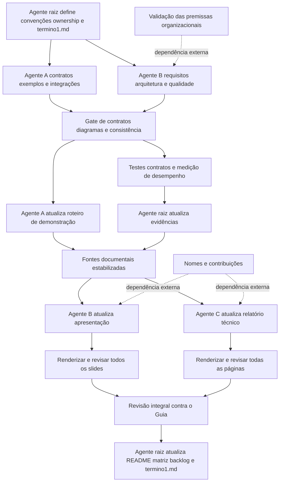

# Plano de conclusão da documentação do Cenário 4

## Objetivo

Concluir a documentação acadêmica do Cenário 4 a partir do `Guia.pdf`, do
plano de implementação, do ADR vigente, dos contratos e do comportamento
executável. O trabalho deve preencher lacunas, melhorar os documentos
existentes e manter rastreabilidade entre requisito, documentação,
implementação, teste e evidência.

Este arquivo controla a ordem do trabalho. Um item só pode ser marcado como
concluído depois que suas dependências e verificações forem atendidas.

## Fontes de verdade

1. `Guia.pdf` para os requisitos acadêmicos.
2. `PLANO_IMPLEMENTACAO_CENARIO_4.md` para escopo, requisitos e critérios de
   aceite.
3. `docs/adr/ADR-001-integracao-empresa-de-servicos.md` para a decisão
   arquitetural vigente.
4. Código, testes, OpenAPI e AsyncAPI para o comportamento implementado.
5. Evidências geradas pela execução atual para resultados mensuráveis.

Em caso de conflito, o guia prevalece. Informações organizacionais ausentes
devem permanecer identificadas como premissas a validar.

## Regras de execução multiagente

- Cada arquivo tem um único proprietário durante toda a execução.
- Os agentes compartilham o mesmo diretório e não devem editar arquivos de
  outro proprietário.
- Revisores registram achados e devolvem as correções ao proprietário.
- Cada entrega inclui arquivos alterados, dependências consumidas,
  verificações executadas, resultados e pendências.
- Relatório e apresentação só podem ser atualizados depois que documentos,
  contratos, roteiro e evidências estiverem estáveis.
- README, matriz de rastreabilidade e backlog são atualizados por último.

## Responsabilidades

| Responsável | Artefatos | Momento |
|---|---|---|
| Agente raiz | `termino1.md`, README, evidências, matriz e backlog | Preparação, gates e encerramento |
| Agente A | Integrações, exemplos, fluxos, OpenAPI, AsyncAPI e roteiro | Documentação-base e demonstração |
| Agente B | Requisitos, AS-IS, TO-BE, qualidade, negócio, evolução e apresentação | Documentação-base e artefato final |
| Agente C | Gerador e relatório técnico DOCX | Depois das fontes e evidências |

## Convenções congeladas

- Fluxos canônicos: F1 Cliente para contrato, F2 Ativação, cobrança e
  onboarding, e F3 Chamado com SLA.
- Eventos canônicos: `CustomerUpdated.v1`, `ContractActivated.v1` e
  `TicketOpened.v1`.
- APIs permanecem sob `/api/v1`.
- Os exemplos devem reutilizar UUIDs fictícios coerentes entre os fluxos.
- `correlationId` deve atravessar HTTP, eventos, auditoria e falhas.
- `causationId` faz parte do envelope obrigatório, embora possa ser nulo
  quando não houver evento causador.
- A apresentação final usa `output/Apresentacao_Cenario_4.pptx`.
- O relatório final usa `output/Relatorio_Tecnico_Cenario_4.docx` e deve ter
  de 15 a 20 páginas.

## Entregas e dependências

| ID | Entrega | Dependências | Critério de aceite | Estado |
|---|---|---|---|---|
| D1 | `docs/REQUISITOS.md` | Guia e plano | RFs, RNFs, prioridades, critérios e rastreabilidade documentados | Concluído |
| D2 | Revisar AS-IS e TO-BE | D1, guia e ADR | Fatos e premissas separados; sistemas, componentes, consumidores, dados e fronteiras completos | Concluído |
| D3 | `docs/EXEMPLOS_API.md` | Código, testes e contratos | Requisições, respostas, erros, replay e correlação válidos para F1-F3 | Concluído |
| D4 | OpenAPI e AsyncAPI | D3 e regras do `AGENT.md` | Contratos válidos, exemplos sincronizados e envelope completo | Concluído |
| D5 | Revisar `docs/INTEGRACOES.md` | D2-D4 | Cada fluxo contém todos os itens exigidos pelo guia | Concluído |
| D6 | `docs/arquitetura/FLUXOS_INTEGRACAO.md` | D3-D5 | Diagramas Mermaid de F1-F3 e cenários alternativos renderizam sem erro | Concluído: sete diagramas renderizados sem erro |
| D7 | Qualidade, evolução e visão de negócio | D2, D5, D6 | Metas, evidências, limitações e viabilidade estão separadas com clareza | Concluído |
| D8 | Roteiro de demonstração | D3-D6 | Outra equipe executa F1-F3 e recuperação sem inferir payloads | Concluído |
| D9 | Evidências atuais | D4, D6 e D8 | Testes, contratos e desempenho executados e registrados com data atual | Concluído: 13 testes e p95 de 6,36 ms |
| D10 | Relatório técnico | D1-D9 e dados da equipe | DOCX entre 15 e 20 páginas e inspeção visual aprovada | Concluído: 18 páginas inspecionadas |
| D11 | Apresentação técnica | D1-D9 e dados da equipe | Deck consistente, renderizado e inspecionado integralmente | Concluído: 15 slides inspecionados |
| D12 | README, matriz e backlog | D10 e D11 | Nenhum item marcado como atendido sem evidência existente | Concluído |

## Melhorias obrigatórias

### Requisitos e arquitetura

- Criar um documento específico de requisitos para eliminar a dependência de
  uma seção isolada do plano.
- Uniformizar os rótulos `Confirmado pelo guia` e `Premissa a validar`.
- Explicitar usuários, dados produzidos e consumidos, comunicação atual,
  limitações, componentes, serviços, bancos, consumidores e fronteiras.

### APIs e integrações

- Documentar cabeçalhos, requisições, respostas e erros dos três fluxos.
- Acrescentar exemplos aos metadados FastAPI/Pydantic e regenerar o OpenAPI,
  em vez de editar um YAML que possa ser sobrescrito.
- Tornar `causationId` obrigatório no esquema AsyncAPI.
- Não descrever atraso exponencial e jitter como comportamento executado se
  a implementação demonstrar apenas repetição por novas chamadas.
- Substituir a descrição abstrata da falha permanente por um procedimento
  reproduzível ou por referência ao teste automatizado correspondente.

### Qualidade, negócio e evolução

- Separar resultado esperado, evidência atual e limitação de validação.
- Responder explicitamente como adicionar módulos e sistemas, alterar uma
  funcionalidade, crescer em usuários e dados, reduzir impacto e atualizar
  gradualmente.
- Analisar custos, complexidade, infraestrutura, equipe, prazo e necessidades
  futuras sem inventar números.

### Relatório e apresentação

- Atualizar os geradores, pois os artefatos finais não consomem os Markdown
  automaticamente.
- Incluir desafios, aprendizados, limitações, riscos e funcionalidades futuras
  no relatório.
- Manter o relatório dentro do limite acadêmico por substituição e
  condensação, sem apenas acrescentar páginas.
- Preservar o sistema visual da apresentação, acrescentar conclusão e
  limitações, e padronizar o nome do arquivo final.

## Gates de validação

### Gate 1 Documentação-base

- Validar JSON, OpenAPI 3.1 e AsyncAPI 3.0.
- Confirmar a correspondência entre o OpenAPI salvo e `app.openapi()`.
- Renderizar todos os blocos Mermaid.
- Conferir todos os campos exigidos para F1, F2 e F3.
- Verificar links e referências cruzadas.

### Gate 2 Comportamento e evidências

- Executar a suíte automatizada completa.
- Executar testes de contrato e arquitetura.
- Executar a medição de desempenho.
- Registrar resultados atuais, sem copiar contagens ou métricas antigas.

### Gate 3 Artefatos acadêmicos

- Regenerar o relatório por seu script-fonte.
- Renderizar o DOCX em PNG e inspecionar todas as páginas a 100%.
- Confirmar de 15 a 20 páginas e ausência de cortes, sobreposições, tabelas
  quebradas ou glifos ausentes.
- Regenerar a apresentação por seu script-fonte.
- Validar o pacote PPTX, renderizar todos os slides e revisar cada um em
  tamanho integral.

### Gate 4 Rastreabilidade final

- Comparar a entrega com as páginas 3 a 13 do guia.
- Atualizar evidências, README, matriz e backlog.
- Marcar DOC-01 e DOC-02 como atendidos apenas após diagramas e exemplos.
- Manter pendências externas abertas e claramente identificadas.

## Dependências externas

- Nomes dos integrantes e suas contribuições individuais.
- Validação das premissas com o professor ou representante da organização.
- Produtos, tecnologias, volumes, responsáveis e interfaces reais dos
  sistemas existentes.

Essas informações não podem ser inventadas. Na ausência delas, os artefatos
devem indicar a pendência e o backlog deve permanecer aberto nos itens
correspondentes.

## Diagrama de execução

